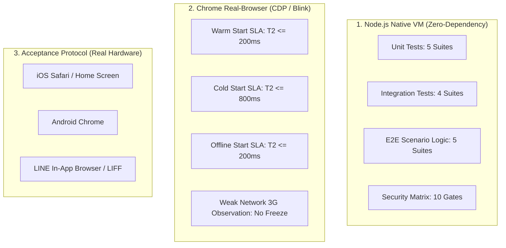

# ADR-017: Universal Testing Architecture & Verification Pyramid

- **Status**: ACCEPTED
- **Date**: 2026-09-25
- **Deciders**: Universal Engine Architecture Team
- **Consulted**: Master Plan Phase 16 Requirements, ADR-015 (Performance), ADR-016 (Security)

---

## 1. Context & Background

マスタープラン Phase 16 では「Testing」として、以下の4カテゴリ・18要件が指定されている：
1. **Unit**: `state`, `parser`, `validation`, `ranking calculation`, `idempotency`
2. **Integration**: `API`, `DB`, `Identity`, `queue`
3. **E2E**: `activity`, `offline`, `reconnect`, `duplicate`, `ranking`
4. **Real Device**: `iOS`, `Android`, `LINE / LIFF`, `weak network`, `offline`

Universal POSTING MAP では、Phase 7〜15 の実装過程において既に 74 以上の強固なテストケースが構築されている。
本フェーズ（Phase 16）において、既存テストで既に保証されている検証項目を把握せず、名前だけを変えた重複テストを大量作成することは、保守性を著しく損ない過剰設計となる。

したがって、本ADRでは以下を正式決定する：
- マスタープラン要求の18要件が既存テスト群および実機測定基盤にどのようにマッピングされているかを体系化（責務固定）。
- 重複テストの作成を厳禁とし、テストカバレッジのトレーサビリティをアンカーテストで自動保証する。
- 実行環境の境界（Node.js VM vs Chrome CDP vs 実機受入プロトコル）を明確に分離する。
- 弱電波環境（Weak Network）における客観的実測・観測指針を規定し、勝手な新規SLAの捏造を排除する。
- レガシーテスト・Phase 12除外コードの隔離（`tests/legacy/`）を公式化する。

---

## 2. Decision: 4-Layer Testing Pyramid & Traceability Matrix

マスタープラン Phase 16 の18項目と、Universal POSTING MAP のテスト実装の完全マッピングを以下のように固定する。

### 2.1 Unit Layer (単体ロジック・純粋関数)
ビジネスロジック、パーサー、バリデーション、計算式、べき等キー生成などの純粋関数を Node.js 高速VM上で検証する。

| マスタープラン要件 | 対応テストファイル | 検証内容・保証境界 |
| :--- | :--- | :--- |
| **state** | `tests/test_phase11_activity_state_machine.mjs` | 活動状態遷移マシン（IDLE ➔ ACTIVE ➔ PAUSED ➔ COMPLETED）、不正遷移遮断、異常系リカバリ |
| **parser** | `tests/test_h_app_core_verification.mjs` | URLパラメータ、JSON応答、マスターデータパーサー（不正形式フォールバック） |
| **validation** | `tests/test_step3_rectification.mjs` `tests/test_phase15_security_verification.mjs` | `validateRequestPayload`、型・文字長・境界値検査、不正入力拒絶 |
| **ranking calculation** | `tests/test_phase13_dashboard_verification.mjs` `tests/test_step2_step3_verification.mjs` | リアルタイム配布ランキング算出アルゴリズム、同点ソート順、cachedRoster 等価性 |
| **idempotency** | `tests/test_posting_flow_verification.mjs` `tests/test_line_push_idempotency_audit.mjs` | `clientMutationId` による二重投稿防止、LINE Push べき等キー監査 |

### 2.2 Integration Layer (結合・境界・サービス間連携)
フロントエンドとバックエンド（GAS/Spreadsheet）、認証境界、キュー永続化の連携を検証する。

| マスタープラン要件 | 対応テストファイル | 検証内容・保証境界 |
| :--- | :--- | :--- |
| **API** | `tests/test_step3_rectification.mjs` `tests/test_storage_register_lifecycle.mjs` | `doGet`/`doPost` エンドポイント整流化、HTTPステータス・エラーコード体系 |
| **DB** | `tests/test_step2_step3_verification.mjs` | `SpreadsheetResolver`、`__DEFAULT__` キャッシュ、Fail-Closed 契約判定 |
| **Identity** | `tests/test_staff_identity_boundary.mjs` `tests/test_phase15_security_verification.mjs` | `lineUserId` ➔ `staffId` ➔ `branchId` 導出チェーン、なりすまし・未登録遮断 |
| **queue** | `tests/test_durable_queue_verification.mjs` | `DurableQueue`、IndexedDB/localStorage 永続化、FIFO順序保持、リトライ指数バックオフ |

### 2.3 E2E Layer (業務シナリオ・エンドツーエンド)
ユーザーの業務フロー全体（配布、オフライン、再接続、ランキング更新）を一気通貫で検証する。

| マスタープラン要件 | 対応テストファイル | 検証内容・保証境界 |
| :--- | :--- | :--- |
| **activity** | `tests/test_phase11_activity_state_machine.mjs` `tests/test_posting_flow_verification.mjs` | 配布開始から町丁目完了、活動終了、実績保存までの完全E2Eフロー |
| **offline** | `tests/test_phase14_performance_verification.mjs` `tests/measure_chrome_real.mjs` | オフライン状態でのUI即時描画（T2 ≤ 200ms）、ローカル蓄積 |
| **reconnect** | `tests/test_durable_queue_verification.mjs` | 回線復帰時の自動フラッシュ、競合解消、オフライン蓄積データの安全送信 |
| **duplicate** | `tests/test_posting_flow_verification.mjs` `tests/test_phase15_security_verification.mjs` | オフライン再送や誤タップによる同一実績の重複登録排除 |
| **ranking** | `tests/test_phase13_dashboard_verification.mjs` `tests/test_dashboard_snapshot.mjs` | 配布実績反映に伴うダッシュボード全体集計・ランキングリアルタイム更新 |

### 2.4 Real Device Layer (実機・実ブラウザ環境)
実機レンダリング、ブラウザエンジン特性、ネットワーク帯域制限の検証。

| マスタープラン要件 | 検証手法・対応ファイル | 検証内容・判定基準 |
| :--- | :--- | :--- |
| **weak network** | `tests/measure_chrome_real.mjs` (Chrome CDP) | 3G相当回線（Latency 300ms, DL 1.5Mbps, UL 750kbps）での実機計測。 ・観測結果: T2 Median 551.9ms, Max 555.0ms ・判定基準: フリーズ・クラッシュなし、ローディング正常解除、操作可能UI展開（勝手な新規SLAは不設定） |
| **offline** | `tests/measure_chrome_real.mjs` (Chrome CDP) | 完全切断環境での実機計測。 ・判定基準: Phase 14 SLA 厳格準拠 (T2 Median ≤ 200ms, Max ≤ 250ms 実測 42.8ms PASS) |
| **iOS** | 実機受入検証プロトコル (手動/運用チェックリスト) | Safari (WebKit) での表示、タッチイベント、PWA/ホーム画面起動 |
| **Android** | 実機受入検証プロトコル (手動/運用チェックリスト) | Chrome (Blink) での表示、戻るボタン挙動、GPS位置情報精度 |
| **LINE / LIFF** | 実機受入検証プロトコル (手動/運用チェックリスト) | LINEアプリ内ブラウザ（LIFF SDK v2）での初期認証、トーク画面遷移 |

---

## 3. Decision: Execution Boundary & Tooling

本システムにおけるテスト実行境界は以下のように厳格に定義される：

1. **Node.js Native VM**:
   - 外部 npm パッケージに一切依存しない（zero-external-dependency）。
   - Node.js 組み込みモジュール（`node:assert/strict`, `node:vm`, `node:crypto`, `node:fs` 等）のみで全論理テストをミリ秒単位で高速実行。
2. **Chrome Real-Browser (Blink Engine + CDP)**:
   - システムにインストールされた Google Chrome を直接ヘッドレス起動。
   - Chrome DevTools Protocol (CDP) の WebSocket ネイティブ接続により、非侵入型で `Performance API`（`T2`, `FCP`）および `Network.emulateNetworkConditions`（Offline, Weak Network）を実測。
   - ヘビーなテストフレームワーク（Playwright / Puppeteer）のインストールを不要とし、環境汚染を防止。
3. **実機（スマートフォン・LINE）**:
   - クラウドファーム等の過剰設計ツールは導入せず、リリース前の「実機受入チェックリスト」として運用。

---

## 4. Decision: Weak Network Evaluation Policy

Phase 16 における Weak Network 検証において、以下の規程を遵守する：
1. **新規SLAの不設定**:
   - Phase 14 で正式合意された SLA は「Warm T2 ≤ 200ms / Cold T2 ≤ 800ms / Offline T2 ≤ 200ms」である。
   - Weak Network に対して勝手に「T2 ≤ 800ms」等の新規数値を設定することは禁止する。
2. **客観的観測と耐障害性保証**:
   - 3G回線（遅延 300ms）において、通信待ちによる画面フリーズ（無応答）が発生しないこと。
   - 楽観的描画（Optimistic UI）またはローディング表示が破綻せず、操作可能UIが正常に展開すること。
   - 実測値（T2 Median 551.9ms）をそのまま記録・公開する。

---

## 5. Decision: Quarantine Policy for Legacy Tests

以下のファイルは現役テストスイートから正式に隔離され、`tests/legacy/` に配置される：
- `tests/legacy/test_bulletin_lifecycle.mjs`（Phase 12 で除外された掲示板機能のコード）
- `tests/legacy/dashboard_verification_gate.mjs`（外部 Playwright 依存）
- `tests/legacy/test_initial_display_sync.mjs`（外部 Playwright 依存）

これらは現役テストの自動実行対象から除外され、全回帰テストにおいて 100% の再現性とクリーンな実行を維持する。

---

## 6. Consequences & Benefits

- **重複排除**: 名前だけを変えた無駄なテストの増殖を防ぎ、保守コストを最小化。
- **完全なトレーサビリティ**: マスタープランの18要件すべてが既存テストおよび実測基盤にマッピングされ、漏れがないことを客観的に証明。
- **実行速度と安定性**: 外部パッケージ依存ゼロにより、全回帰テストがわずか数秒で完結。
