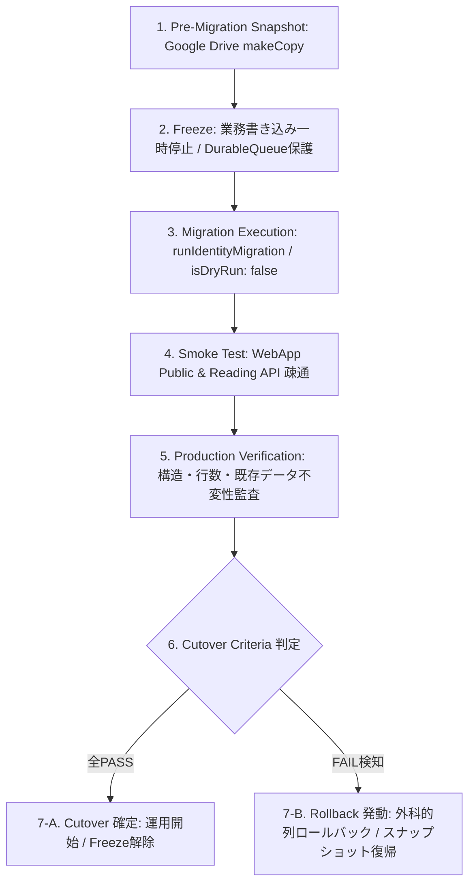

# ADR-020: Universal Cutover & Rollback Standard Operating Procedure (SOP)

- **Status**: ACCEPTED
- **Date**: 2026-09-25
- **Deciders**: Universal Engine Architecture Team
- **Consulted**: Master Plan Phase 19 Requirements, ADR-018, ADR-019, DATA_LIFECYCLE.md

---

## 1. Context & Purpose

マスタープラン Phase 19 では「Cutover / Rollback」として**「切替手順を文書化する」**ことが明確に定義されている：

```text
## Phase 19 — Cutover / Rollback

切替手順を文書化する。

- Cutover criteria
- Freeze
- Migration
- Smoke test
- Production verification
- Rollback trigger
- Rollback procedure
```

本仕様書は、Phase 18 で確定した [ADR-019: Migration Architecture](file:///Volumes/SSD_DATA/posting-map-universal/docs/architecture/decisions/ADR-019_MIGRATION_ARCHITECTURE.md) を前提とし、本番環境への切替（Cutover）および障害発生時の復元（Rollback）に関する 7 つの運用工程を公式な標準運用手順（SOP）として確定・固定するものである。

本フェーズでは**切替手順の具体化と安全な実行条件の検証**を完了対象とし、実データの一括書き換えや強制切替は本手順に従い別途承認の下で実施する。

---

## 2. The 7-Step Cutover & Rollback Specification



---

### 2.1 Cutover criteria (切替基準・合否判定条件)

本番切替（Cutover）を承認するための必須条件を以下の通り定義する。以下の全項目が 100% 満たされない限り、切替を完了としてはならない：

1. **事前スナップショット確立**:
   - Google Drive 上にタイムスタンプ付きの複製スプレッドシート（`BACKUP_${ssName}_${timestamp}`）が作成され、正常にアクセス可能であること。
2. **Freeze（書き込み停止）の完了**:
   - 現場からの新規書き込みが停止され、インフライト通信（実行中の書き込みリクエスト）がゼロであること。
3. **Dry-Run 100% 整合**:
   - `action=runIdentityMigration`（`isDryRun: true`）の実行結果において、エラーゼロ、および更新予定行数・スキップ理由が事前計画と完全に一致していること。
4. **実マイグレーション正常終了**:
   - `action=runIdentityMigration`（`isDryRun: false`）が例外なく正常終了し、`{ success: true }` が返却されること。
5. **不変条件（Invariants）検証合格**:
   - スプレッドシートの総データ行数が増減していないこと（消失・重複ゼロ）。
   - 既存 A〜O列の配布実績データ（完了日時、枚数、GPS、写真）が 1 文字も改変されていないこと。
   - `ST001` 等の名前不一致行が空欄のまま保全されていること。
6. **本番スモークテスト合格**:
   - 本番 Web App の公開 API および業務閲覧 API がすべて HTTP 200 で正常稼働していること。

---

### 2.2 Freeze (業務凍結・書き込み停止プロトコル)

マイグレーション実行中のデータ整合性を保つため、以下のプロトコルで書き込みを一時停止する：

1. **現場端末データの消失ゼロ保証**:
   - 現場党員の Hアプリは `DurableQueue`（IndexedDB）を搭載している。
   - サーバー側がメンテナンス中・一時遮断時でも、現場での配布入力データは端末内で暗号学的 UUID と共に安全に保留される。
2. **書き込み停止の実施**:
   - 管理者による事前アナウンスを実施。
   - スプレッドシート `SYSTEM_INFO` または GAS `LockService` を用いて、業務更新 API（`recordDistribution`, `registerFlyerStock` 等）への書き込みを一時的に遮断・保留する。
3. **インフライトリクエストのドレイン**:
   - 停止宣言後、30 秒間待機して通信中のリクエストが完全に完了（ドレイン）したことを確認する。

---

### 2.3 Migration (実マイグレーション実行手順)

実マイグレーションは、以下の厳格なステップで実行する：

1. **Dry-Run の実行**:
   ```json
   POST /exec
   {
     "action": "runIdentityMigration",
     "provisioningToken": "<SECRET_TOKEN>",
     "isDryRun": true
   }
   ```
   - レポート内容（追加ヘッダー、更新予定行、スキップ行）を点検し、予期せぬ不一致がないか確認する。
2. **実マイグレーションの実行**:
   ```json
   POST /exec
   {
     "action": "runIdentityMigration",
     "provisioningToken": "<SECRET_TOKEN>",
     "isDryRun": false
   }
   ```
   - 既存列を変更せず、末尾に P列（`lineUserId`）、Q列（`requestId`）、G列（在庫 `lineUserId`）、M-N列（受渡 `lineUserIds`）を追加（Additive Schema Evolution）。
   - 名簿と完全一致する安全な行のみ `lineUserId` を補完。

---

### 2.4 Smoke test (本番スモークテスト)

マイグレーション直後、以下の主要エンドポイントを順次検証する：

1. **公開 API 疎通**:
   - `GET /exec?action=registerOrValidateDevice` ➔ HTTP 200 `{ success: true, authorized: true }`
   - `GET /exec?action=getDeviceStatus` ➔ HTTP 200 `{ success: true, exists: false, rows: [] }`
2. **業務閲覧 API 疎通**:
   - `POST /exec { "action": "getDashboardSnapshot" }` ➔ HTTP 200 正常データ返却
   - `POST /exec { "action": "getRanking" }` ➔ HTTP 200 正常ランキング返却
   - `POST /exec { "action": "getFlyerStock" }` ➔ HTTP 200 正常在庫返却
3. **セキュリティ & 整合性ガード**:
   - 未知地区パラメータ ➔ HTTP 200 `{ success: false, code: "DISTRICT_MISMATCH" }` による安全遮断。

---

### 2.5 Production verification (本番反映検証)

本番スプレッドシートの実態に対し、以下の監査を実施する：

1. **ヘッダー構造監査**:
   - `配布実績` シートの 16 列目（P列）が `"lineUserId"`、17 列目（Q列）が `"requestId"` であること。
   - `保有チラシ枚数` シートの 7 列目（G列）が `"lineUserId"` であること。
2. **データ行数監査**:
   - 各シートの最終行番号（LastRow）が移行前と完全に同一であること。
3. **ST001 矛盾行の保全確認**:
   - 名簿と名前が不一致の行において、P列が確実に空欄（空白文字列）のまま保全されていること。

---

### 2.6 Rollback trigger (ロールバック発動条件)

以下の事象が **1 件でも発生した場合、即座にマイグレーションを中止し、ロールバックを発動** する：

1. **API 致命的エラー**:
   - スモークテストにおいて、HTTP 500、GAS 実行時間超過（タイムアウト）、または破損レスポンスが返却された場合。
2. **データ行の消失・破損**:
   - 総行数が移行前より減少した場合、または既存 A〜O列のデータが破損・改変された場合。
3. **異常スキップの多発**:
   - 本来一致すべき配布員が想定外の理由で大量に未解決（スキップ）となった場合。
4. **現場通信障害の多発**:
   - 凍結解除後、現場端末からのキューフラッシュ（`DurableQueue` 送信）で永続的失敗が多発した場合。

---

### 2.7 Rollback procedure (ロールバック手順)

障害発生時は、以下の優先順位で安全に原状復帰を実施する：

#### Level 1: 外科的列ロールバック (Surgical Column Rollback — 第一推奨)
- **概要**: 追加された新設列（P列、Q列、G列、M-N列）のみをクリアまたは列削除する。
- **安全性**: **極めて高い**。他の町丁目の正当な配布実績を一切巻き戻すことなく、数秒で旧スキーマ状態へ原状復帰できる。
- **手順**:
  1. スプレッドシート `配布実績` の 16 列目以降をクリア。
  2. `保有チラシ枚数` の 7 列目をクリア。
  3. `受渡要請履歴` の 13〜14 列目をクリア。
  4. 現場書き込みを再開。

#### Level 2: 事前スナップショット復元 (Snapshot Restore — 緊急時)
- **概要**: マイグレーション直前に複製退避したバックアップスプレッドシート（`BACKUP_${ssName}_${timestamp}`）をアクティブ DB として再バインドする。
- **適用条件**: スプレッドシートの構造や既存データが不可逆的に破損した場合。
- **厳格な禁止事項**:
  - **Google Spreadsheet の「版の履歴」からの全体一括復元は永久禁止**とする（障害発生後に現場で登録された正当な配布実績まで不可逆的に消失するため）。

---

## 3. Consequences & Operational Integrity

- **運用リスクの局所化**: Additive Schema と外科的列ロールバックにより、データ消失リスクを完全に排除。
- **切替判断の客観化**: 属人的な勘に頼らず、6 つの Cutover criteria による機械的な合否判定を実現。
- **Phase 20 (Monitoring) への安全な引き継ぎ**: 正常切替完了後、リアルタイムなエラー監視・キュー遅延監視（Phase 20）へ円滑に移行可能。
